# Pseudodemocracy

A satirical party game about Nigerian politics for 3 to 10 players, played online. Players perform, vote, sit exams, amend the Constitution, form unions and mobs, and try to outlast each other as Leader. Built with **Godot 4.7 and GDScript**, with a **server-authoritative rules engine** that is pure logic and tested headless, a WebSocket server, and a phone-first (landscape) client.

## Status

| Part | State |
|---|---|
| Rules engine (`scripts/`) | Complete for the current rules: elections and exams, amendments, performances and all three card decks, roles, unions and mobs, coups, the Vice, rivals, loyalists, corruption, wills and elimination. Grammar checking of amendments is switched off for now. |
| Server (`server/`) | Rooms, seats, reconnect tokens, per-player views, a save after every accepted move, restore on restart. Hosting files are written but not yet tried (see `docs/deploying.md`). |
| Client (`client/`) | Landscape phone UI: lobby, oval table, centre card and vote buttons, exam sheets, ballot. Amendments, private panels, the event feed and the end screen are still to build. |

The full plan is in [`docs/build_plan.md`](docs/build_plan.md), and every rule decision, with who confirmed it, is in [`docs/design_decisions.md`](docs/design_decisions.md).

## How it fits together

```mermaid
%% Generated by https://gitdiagram.com/somunaexe/pseudodemocracy
flowchart TD

subgraph group_client["Player Client"]
  node_lobby["Lobby Screen<br/>[lobby_screen.gd]"]
  node_connection["Connection<br/>[connection.gd]"]
  node_table["Table Screen<br/>[table_screen.gd]"]
  node_exam_ui["Exam Screen<br/>[exam_screen.gd]"]
  node_client_models["Client Models<br/>[session_model.gd]"]
end

subgraph group_engine["Game Engine"]
  node_game["Game Coordinator<br/>[game.gd]"]
  node_state["Game State<br/>[game_state.gd]"]
  node_turns["Turn Flow"]
  node_law["Law Amendment<br/>[amendment_flow.gd]"]
  node_cards["Card Effects<br/>[card_effects.gd]"]
  node_scoring["Scoring<br/>[scoring.gd]"]
  node_views["Game Views<br/>[views.gd]"]
end

subgraph group_content["Game Content"]
  node_articles_source["Article Source<br/>[articles.js]"]
  node_cards_source["Card Source<br/>[cards.js]"]
  node_exam_source["Exam Questions<br/>[exam_questions.js]"]
  node_game_data_source["Rules Data<br/>[game_data.js]"]
end

subgraph group_server["Session Server"]
  node_disk_store[("Disk Store<br/>[disk_store.gd]")]
  node_memory_store[("Memory Store<br/>[memory_store.gd]")]
  node_server_core["Server Core<br/>[server_core.gd]"]
  node_websocket["WebSocket Server<br/>[ws_server.gd]"]
  node_sessions["Game Sessions<br/>[session_model.gd]"]
end

node_player(("Player"))

node_player -.->|"enters lobby"| node_lobby
node_lobby -.->|"connects through"| node_connection
node_connection -.->|"communicates with"| node_websocket
node_websocket -.->|"dispatches to"| node_server_core
node_server_core -.->|"manages"| node_sessions
node_sessions -.->|"may store in"| node_memory_store
node_sessions -.->|"may persist to"| node_disk_store
node_player -.->|"plays at"| node_table
node_table -.->|"sends actions to"| node_game
node_game -.->|"updates"| node_state
node_game -.->|"advances"| node_turns
node_game -.->|"handles amendments via"| node_law
node_game -.->|"applies"| node_cards
node_game -.->|"calculates results with"| node_scoring
node_table -.->|"displays"| node_views
node_player -.->|"takes exam at"| node_exam_ui
node_exam_ui -.->|"uses questions from"| node_exam_source
node_game -.->|"uses article content from"| node_articles_source
node_game -.->|"uses card content from"| node_cards_source
node_cards_source -->|"imports rules values from"| node_game_data_source

click node_lobby "https://github.com/somunaexe/pseudodemocracy/blob/main/client/lobby_screen.gd"
click node_connection "https://github.com/somunaexe/pseudodemocracy/blob/main/client/connection.gd"
click node_table "https://github.com/somunaexe/pseudodemocracy/blob/main/client/table_screen.gd"
click node_exam_ui "https://github.com/somunaexe/pseudodemocracy/blob/main/client/exam_screen.gd"
click node_client_models "https://github.com/somunaexe/pseudodemocracy/blob/main/client/session_model.gd"
click node_game "https://github.com/somunaexe/pseudodemocracy/blob/main/scripts/game.gd"
click node_state "https://github.com/somunaexe/pseudodemocracy/blob/main/scripts/game_state.gd"
click node_law "https://github.com/somunaexe/pseudodemocracy/blob/main/scripts/amendment_flow.gd"
click node_cards "https://github.com/somunaexe/pseudodemocracy/blob/main/scripts/card_effects.gd"
click node_scoring "https://github.com/somunaexe/pseudodemocracy/blob/main/scripts/scoring.gd"
click node_views "https://github.com/somunaexe/pseudodemocracy/blob/main/scripts/views.gd"
click node_articles_source "https://github.com/somunaexe/pseudodemocracy/blob/main/data/source/articles.js"
click node_cards_source "https://github.com/somunaexe/pseudodemocracy/blob/main/data/source/cards.js"
click node_exam_source "https://github.com/somunaexe/pseudodemocracy/blob/main/data/source/exam_questions.js"
click node_game_data_source "https://github.com/somunaexe/pseudodemocracy/blob/main/data/source/game_data.js"
click node_disk_store "https://github.com/somunaexe/pseudodemocracy/blob/main/server/disk_store.gd"
click node_memory_store "https://github.com/somunaexe/pseudodemocracy/blob/main/server/memory_store.gd"
click node_server_core "https://github.com/somunaexe/pseudodemocracy/blob/main/server/server_core.gd"
click node_websocket "https://github.com/somunaexe/pseudodemocracy/blob/main/server/ws_server.gd"
click node_sessions "https://github.com/somunaexe/pseudodemocracy/blob/main/client/session_model.gd"

classDef toneNeutral fill:#f8fafc,stroke:#334155,stroke-width:1.5px,color:#0f172a
classDef toneBlue fill:#dbeafe,stroke:#2563eb,stroke-width:1.5px,color:#172554
classDef toneAmber fill:#fef3c7,stroke:#d97706,stroke-width:1.5px,color:#78350f
classDef toneMint fill:#dcfce7,stroke:#16a34a,stroke-width:1.5px,color:#14532d
classDef toneRose fill:#ffe4e6,stroke:#e11d48,stroke-width:1.5px,color:#881337
classDef toneIndigo fill:#e0e7ff,stroke:#4f46e5,stroke-width:1.5px,color:#312e81
classDef toneTeal fill:#ccfbf1,stroke:#0f766e,stroke-width:1.5px,color:#134e4a
class node_lobby,node_connection,node_table,node_exam_ui,node_client_models toneBlue
class node_game,node_state,node_turns,node_law,node_cards,node_scoring,node_views toneAmber
class node_articles_source,node_cards_source,node_exam_source,node_game_data_source toneMint
class node_disk_store,node_memory_store,node_server_core,node_websocket,node_sessions toneRose
class node_player toneIndigo
```



The diagram is generated and simplified, so two things are drawn looser than they are:

- **The client never talks to the engine directly.** The table screen sends commands over the WebSocket to the server, and the server runs `Game.handle`. The phone only ever receives the events and view it is allowed to see (`views.gd`), so the rules, and every secret, stay on the server.
- **"Game Sessions" is really `server/server_core.gd`** (rooms, seats, tokens). `client/session_model.gd` is the phone's own record of what the server told it.

## Principles

- **The server decides.** Clients only ask (a command); the server checks it against the rules and replies with events. A client never says who it is: its seat does.
- **The engine is pure logic.** No nodes, no sockets, no clock of its own; the server feeds it time. That is why the whole game, including a full simulation of many games, runs headless in tests.
- **Secrets stay secret.** Exam answer keys, ballots, wills and the random seed never leave the server; `views.gd` is an allow-list, and a new field is hidden until someone classifies it.
- **Rules live in data.** Cards, articles, exam questions and numbers are in `data/source/*.js`, exported to JSON for Godot.

## Running things

You need [Godot 4.7](https://godotengine.org) and, for the data tools, Node.js.

```bash
# the tests (parallel and quiet; add words to run only matching files, -v to see every PASS)
GODOT=/path/to/godot tools/run_tests.sh
GODOT=/path/to/godot tools/run_tests.sh scandal peeks

# the server
godot --headless --script server/ws_server.gd -- --port 9080 --data ./saves

# the real phone code against the real server (a smoke test)
GODOT=/path/to/godot tools/smoke_server.sh

# a picture of the table for N players (needs a display, e.g. xvfb-run)
xvfb-run -a godot --rendering-driver opengl3 --resolution 1280x720 \
  --script tools/screenshot_table.gd -- 7 /tmp/table.png vote

# after editing anything in data/source/
node tools/export_game_data.js && node tools/export_cards.js && node tools/export_articles.js && node tools/export_exam_questions.js
```

Open the project in Godot and run it to start the client (landscape, 1280x720, built for phones). Point it at the server address on the first screen.

## Layout

| Folder | What is in it |
|---|---|
| `scripts/` | The rules engine (`game.gd` is the front door) |
| `server/` | Rooms, tokens, saving, the WebSocket transport |
| `client/` | The phone UI and its pure models |
| `data/` | Game data: `source/*.js` is the source, the `.json` files are generated |
| `tests/` | One file per area, plus a whole-game simulation |
| `tools/` | Test runner, data exporters, smoke test, screenshot tool |
| `docs/` | Build plan, every design decision, deploying, screenshots |
